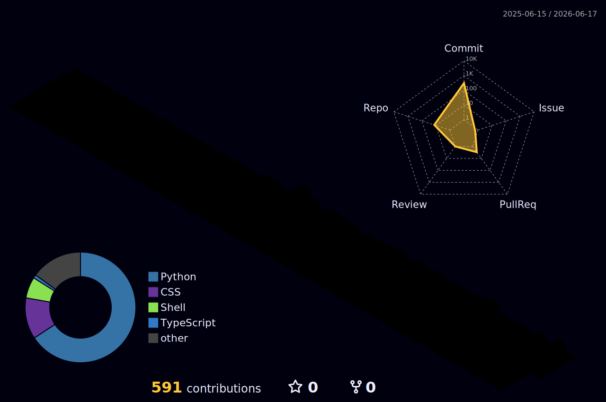

&nbsp;&nbsp;

  

  A 17-year-old data enthusiast based in Bangalore, passionate about uncovering insights and turning them into meaningful solutions. My curiosity about how data shapes decisions drives my work, and I am currently building a toolkit across analytics, machine learning, and predictive modeling.

- 🎓 High school student currently studying A-levels
- 🌍 Based in Bangalore, India
- 🧠 Expanding my knowledge of advanced ML and data science frameworks
- 🤝 Open to collaborate on data analysis, predictive modeling, and visualization
- 🎯 Goal: build a high-performance data science toolkit
- ⚡ Driven by curiosity about how data shapes decision-making

 

<table width="100%">
  <tr>
    <td align="center" bgcolor="#F3F4F6"><strong>Currently Building</strong></td>
  </tr>
</table>

| Project | What it does | Stack | Stage |
|---|---|---|---|
| 🎵 **Local Shazam** | Identifies songs from short local clips | Python · ACRCloud · scipy.fft |  |
| 📚 **CAIE Past Paper Predictor** | Analyzes papers and predicts likely question patterns | Python · Streamlit · pdfplumber · pandas |  |

**Build Priorities**

- 🎵 Local Shazam: improve matching accuracy and speed on noisy audio
- 📚 CAIE Predictor: strengthen extraction and trend consistency across years

<table width="100%">
  <tr>
    <td align="center" bgcolor="#F3F4F6"><strong>Projects Completed</strong></td>
  </tr>
</table>

### 🎬 [Movie & TV Tracker Website](https://github.com/icecold009/movie-tracker)
 

> A personal web app to track movies and TV shows with auto-fetched TMDB cover art, Watched/Want-to-Watch states, and a color-coded 1-10 rating bar. Includes password-protected admin access with a public read-only view.

**Stack:** Python · Flask · PostgreSQL · TMDB API · Render · Supabase

### 📖 [TIL — Today I Learned Repository](https://github.com/icecold009/til)
 

> A growing collection of structured learning notes and diagrams with 30+ entries across CS fundamentals, system design, networking, databases, machine learning, OS concurrency, and developer workflow.

**Focus Areas:** Markdown · Computer Science · System Design · Networking · Security · OS Concurrency

### 👤 [Face Attendance System](https://github.com/icecold009/face-attendance-opencv-python)
 

> A local-first face recognition system for automatic attendance marking. Features real-time face detection at ~5 fps, one-entry-per-person-per-day deduplication, a modern Flask web dashboard with live webcam feed, and daily CSV export — all running 100% offline with no cloud dependencies.

**Stack:** Python · OpenCV · face-recognition · dlib · Flask · pandas

<table width="100%">
  <tr>
    <td align="center" bgcolor="#F3F4F6"><strong>Skills</strong></td>
  </tr>
</table>

### Programming Languages

  

### Frameworks and Libraries

  

### Databases and Cloud

  

### Software and Tools

  

<strong>────────── ✦ ✦ ✦ ──────────</strong>

  

  

<strong>────────── ✦ ✦ ✦ ──────────</strong>

  

<table width="100%">
  <tr>
    <td align="center" bgcolor="#F3F4F6"><strong>Connect</strong></td>
  </tr>
</table>

  

  
  &nbsp;&nbsp;
  
  &nbsp;&nbsp;
  
  &nbsp;&nbsp;

