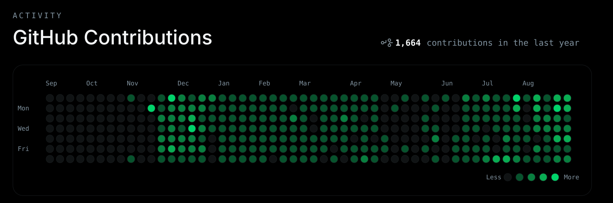

<table align="center" width="100%" border="1" cellpadding="18" cellspacing="0">
<tr>
<td align="center">
<h1>Shaurya Saria</h1>

Student software developer in Bengaluru building web applications, full-stack products, and data-driven AI and machine-learning projects.

I like making boundaries visible: what is local, what is simulated, what has been evaluated, and what still needs proof.

<strong>Focus:</strong> Applied AI · Full-stack products · ML evaluation · Audio systems · Open source

&nbsp;&nbsp;&nbsp;&nbsp;

&nbsp;&nbsp;&nbsp;&nbsp;
<a href="https://www.kaggle.com/shauryasaria" title="Kaggle">Kaggle</a>
&nbsp;&nbsp;&nbsp;&nbsp;

</td>
</tr>
</table>

## Current work

| Project | Description | Stack |
| --- | --- | --- |
| [Touchscreen Launchpad](https://github.com/icecold009/touchscreen-launchpad) | Local-first browser instrument with five reusable kits, an IndexedDB sample library, `.launchpack` backup/restore, recording, slicing, scenes, MIDI export, and an offline PWA shell. | JavaScript, Web Audio, IndexedDB, PWA |
| [Shaurya Portfolio](https://github.com/icecold009/shaurya-portfolio) | Editorial portfolio and project archive with case studies, writing, certificates, artwork, contact flows, and a production launch on `shauryasaria.me`. | React, Vite, MDX, Vercel |
| [Daymark Planner](https://github.com/icecold009/daymark-planner) | Deadline-first planner for tasks, college applications, scholarships, and freelance client work, with exportable backups and calendar files. | Next.js, TypeScript, Cloudflare Workers, D1 |
| [Multiclass Imbalance Benchmark](https://github.com/icecold009/multiclass-imbalance-benchmark) *(private)* | Evidence-first benchmark workflow with Stage 0 Gates A–F complete, a frozen protocol, clean-checkout reproducibility, and a data-free CPU execution package. | Python, pandas, scikit-learn, pytest |
| [AIIJC 2026 Preparation](https://github.com/icecold009/aiijc-2026-prep) *(private)* | Reproducible contest-preparation workspace with structured task layouts, solvers, submissions, and archived main-stage packages. | Python, pandas, scikit-learn |
| [Boundary](https://github.com/icecold009/Sports-app) *(private)* | Mobile-first, voice-first cricket scorer with touch fallback, offline recovery, corrections, and an explicit hosted-sync boundary. | React, TypeScript, IndexedDB, Supabase |
| [Private Dinner Booking App](https://github.com/icecold009/Booking-app) *(private)* | Mobile-friendly booking workflow for staff-configured private-dinner slots, reservations, confirmations, and cancellations. | Next.js, Prisma, PostgreSQL |
| [School Lost and Found](https://github.com/icecold009/school-lost-and-found) *(private)* | School-only lost-property workflow with matching, review, claims, return tracking, and privacy-aware evaluation boundaries. | React, FastAPI, PostgreSQL, pgvector |

## Hackathons

| Project | Description | Stack |
| --- | --- | --- |
| [RiskCourt](https://github.com/icecold009/alpaca-ai-trading-agents-hackathon) | Paper-only options agent for the Alpaca AI Trading Agents Hackathon: independent jurors produce evidence-bound forecasts, calibration creates a bounded probability, and deterministic risk gates decide whether a defined-risk spread is eligible. | Python, FastAPI, React, Alpaca API |
| [PolicyLens](https://github.com/icecold009/hacksocial-policylens) | Privacy-conscious AI/ML MVP for asking questions about clearly labelled synthetic school-policy documents, returning plain-English answers with evidence or an explicit needs-review state. | React, Vite, Node.js |
| [IceCold Sprint](https://github.com/icecold009/lablab-hackathon-study-app) | Local-first study-planning MVP that turns confidence, importance, and available time into a focused sprint, then uses a five-question quiz to recommend what happens next. | React, Vite, localStorage |
| [StadiumPulse AI](https://github.com/icecold009/stadiumpulse-ai) | GenAI command center for simulated stadium operations: telemetry becomes grounded alerts and recommendations while authenticated people remain in control of every action. | Next.js, TypeScript, Supabase, Realtime |

## Selected projects

| Project | Description | Stack |
| --- | --- | --- |
| [Audio Recognition](https://github.com/icecold009/Audio-Recognition) | Microphone- and file-based recognition showcase with one bounded audio pipeline, RapidAPI/Shazam, AcoustID, AudD, and a local constellation-hash backend. | Python, Flask, FFmpeg, audio fingerprinting |
| [E-commerce Customer Analytics](https://github.com/icecold009/ecommerce-customer-analytics) | Reproducible Olist analytics pipeline with raw-table preservation, a documented cleaning layer, revenue and delivery analysis, RFM segments, and customer cohorts. | Python, SQLite, pandas, pytest |
| [Token Smart Router](https://github.com/icecold009/token-smart-router) · [Hackathon submission](https://lablab.ai/submissions/hbq8u2w0pokj9wcxpulv72qy) | Hybrid AI routing web app that answers simple prompts locally and sends more complex requests to a configured Fireworks model, with the route visible in the UI. Benchmark scoring and execution-based accuracy checks remain future work. | React, Vite, Express, Fireworks AI |
| [F1 Championship Forecasting](https://github.com/icecold009/f1-championship-prediction) | Leakage-safe walk-forward evaluation of pre-season championship forecasts against a previous-season baseline. | Python, pandas, scikit-learn |
| [CAIE Past Paper AI](https://github.com/icecold009/past-paper-ai) | PDF parsing and Gemini-assisted analysis for finding recurring exam patterns and supporting targeted revision. | Python, pdfplumber, Gemini, Streamlit |
| [Movie & TV Tracker](https://github.com/icecold009/movie-tracker) | Watchlist and recommender built around TMDB metadata, PostgreSQL, Supabase, protected mutations, and transparent recommendation logic. | Flask, PostgreSQL, Supabase, TMDB |
| [NextSound](https://github.com/icecold009/Spotify-clone-mini-project) | Music discovery interface with a useful demo mode and an optional Spotify API search path. | React, TypeScript, Vite, Spotify API |
| [Car Price Predictor](https://github.com/icecold009/car-price-predictor) | Regression pipeline comparing models and supporting both batch and single predictions. | Python, pandas, scikit-learn, Flask |
| [Face Attendance System](https://github.com/icecold009/face-attendance-opencv-python) | Local webcam face-recognition and attendance workflow with enrollment, deduplication, and CSV reporting. | Python, OpenCV, Flask |

See the [portfolio](https://shauryasaria.me/) for the wider archive of projects, writing, certificates, and experiments.

## Open source and learning

| Project | Description | Stack |
| --- | --- | --- |
| [AI Language Partner](https://github.com/duct-tape2/ai-language-partner/pull/151) | Proposed Windows portability repair for the FastAPI API, including platform-safe dependency handling and functional contract verification. | Python, FastAPI, pytest |
| [Node.js](https://github.com/nodejs/node/pull/65999) | Draft contribution preserving the underlying filesystem errno in `fs.rmSync` errors instead of degrading unmapped failures to `UV_UNKNOWN`. | C++, Node.js internals |
| [Code Racer](https://github.com/icecold009/code-racer) | Community multiplayer coding game for real-time programming challenges. | Next.js, TypeScript, Tailwind, Prisma |
| [Codeforces Grind](https://github.com/icecold009/codeforces-grind) | Ongoing algorithm and competitive-programming practice. | Algorithms, data structures |
| [TIL: Today I Learned](https://github.com/icecold009/TIL-Today-I-learnt) | Running log of CS concepts, algorithms, system design, and lessons from building. | Markdown, CS theory |
| [Open Source Practice](https://github.com/icecold009/contribute-to-open-source) | Interactive workflows for learning GitHub contributions, pull requests, and repository habits. | Git, GitHub, pull requests |

## Contribution activity

  

## Skills

  <strong>Languages</strong> 
  

  <strong>Frameworks and libraries</strong> 
  

  <strong>Data and cloud</strong> 
  

  <strong>Tools</strong> 
  

Profile refreshed in September 2026.

