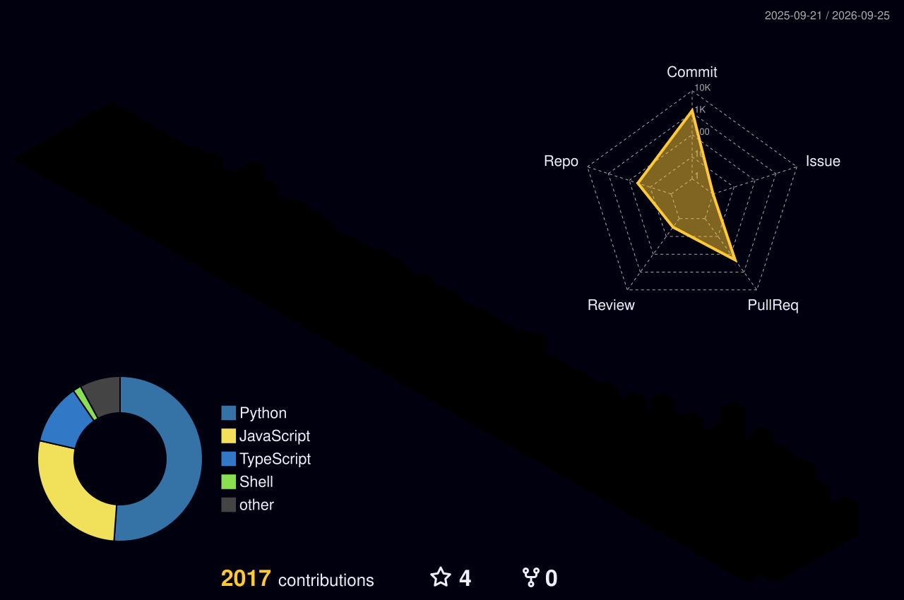

&nbsp;&nbsp;

  

A-level student in Bengaluru building ML pipelines, audio signal processing, and full-stack apps.
Open to collaborate on data analysis and predictive modeling. Applying to CS programmes (2026 entry).

<h2>Currently Building</h2>
<table width="100%" cellpadding="12" cellspacing="12">
  <tr>
    <td width="50%" valign="top" bgcolor="#0F172A" style="border:1px solid #334155; border-radius:12px;">
      <h3><a href="https://github.com/icecold009/shaurya-portfolio">Shaurya Portfolio</a></h3>
       
      
Personal portfolio site for projects, skills, and writing.

      <pre>React • Tailwind CSS • Vercel</pre>
    </td>
    <td width="50%" valign="top" bgcolor="#0F172A" style="border:1px solid #334155; border-radius:12px;">
      <h3><a href="https://github.com/icecold009/token-smart-router">Token Smart Router</a></h3>
       
      
Token-aware routing and smarter request handling.

      <pre>JavaScript • TypeScript • Routing logic</pre>
    </td>
  </tr>
  <tr>
    <td width="50%" valign="top" bgcolor="#0F172A" style="border:1px solid #334155; border-radius:12px;">
      <h3>AAPL DCF Valuation</h3>
       
      
yfinance data pull + 5-year DCF with user assumptions, intrinsic value, and margin of safety.

      <pre>Python • yfinance • DCF • pandas</pre>
    </td>
    <td width="50%" valign="top" bgcolor="#0F172A" style="border:1px solid #334155; border-radius:12px;">
      <h3>Portfolio Backtester</h3>
       
      
Custom portfolio vs SPY with weighting, rebalancing, Sharpe, drawdown, alpha/beta, and grade.

      <pre>Python • yfinance • pandas • numpy</pre>
    </td>
  </tr>
  <tr>
    <td width="50%" valign="top" bgcolor="#0F172A" style="border:1px solid #334155; border-radius:12px;">
      <h3>Weather × Energy Study</h3>
       
      
Tests if temperature/weather predict energy returns (XLE, USO, XOM, etc.) with evidence strength.

      <pre>Python • NOAA • Meteostat • statsmodels</pre>
    </td>
    <td width="50%" valign="top"></td>
  </tr>
</table>

<h2>Projects Completed</h2>
<table width="100%" cellpadding="12" cellspacing="12">
  <tr>
    <td width="50%" valign="top" bgcolor="#0F172A" style="border:1px solid #334155; border-radius:12px;">
      <h3><a href="https://github.com/icecold009/stadiumpulse-ai">StadiumPulse AI</a></h3>
       
      
AI analytics turning match and venue data into practical insights.

      <pre>TypeScript • AI workflows • Data dashboards</pre>
    </td>
    <td width="50%" valign="top" bgcolor="#0F172A" style="border:1px solid #334155; border-radius:12px;">
      <h3><a href="https://github.com/icecold009/Audio-Recognition">Audio Recognition</a></h3>
       
      
DIY Shazam-style app using FFT analysis and fingerprinting.

      <pre>Python • Flask • React • scipy.fft</pre>
    </td>
  </tr>
  <tr>
    <td width="50%" valign="top" bgcolor="#0F172A" style="border:1px solid #334155; border-radius:12px;">
      <h3><a href="https://github.com/icecold009/movie-tracker">Movie &amp; TV Tracker</a></h3>
       
      
Watchlist app with PostgreSQL, Supabase auth, and TMDB API.

      <pre>Flask • PostgreSQL • Supabase • TMDB API</pre>
    </td>
    <td width="50%" valign="top" bgcolor="#0F172A" style="border:1px solid #334155; border-radius:12px;">
      <h3>CAIE Past Paper AI</h3>
       
      
Past-paper analysis with PDF parsing and Gemini to predict patterns.

      <pre>Python • pdfplumber • Gemini API • Streamlit</pre>
    </td>
  </tr>
  <tr>
    <td width="50%" valign="top" bgcolor="#0F172A" style="border:1px solid #334155; border-radius:12px;">
      <h3><a href="https://github.com/icecold009/face-attendance-opencv-python">Face Attendance System</a></h3>
       
      
Real-time webcam face recognition for automated attendance.

      <pre>Python • OpenCV • face_recognition • TensorFlow</pre>
    </td>
    <td width="50%" valign="top" bgcolor="#0F172A" style="border:1px solid #334155; border-radius:12px;">
      <h3><a href="https://github.com/icecold009/f1-championship-prediction">F1 Championship Prediction</a></h3>
       
      
Random Forest model predicting championship outcomes from race data.

      <pre>Python • scikit-learn • pandas • matplotlib</pre>
    </td>
  </tr>
  <tr>
    <td width="50%" valign="top" bgcolor="#0F172A" style="border:1px solid #334155; border-radius:12px;">
      <h3><a href="https://github.com/icecold009/TIL-Today-I-learnt">TIL: Today I Learned</a></h3>
       
      
Running log of CS concepts, algorithms, and system design.

      <pre>Markdown • CS Theory • Algorithms • System Design</pre>
    </td>
    <td width="50%" valign="top"></td>
  </tr>
</table>

<table width="100%">
  <tr>
    <td align="center" bgcolor="#F3F4F6"><strong>Skills</strong></td>
  </tr>
</table>

### Programming Languages

  

### Frameworks and Libraries

  

### Databases and Cloud

  

### Software and Tools

  

  

  

