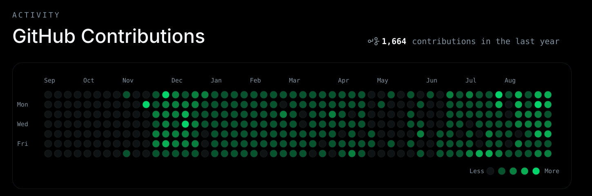

<table align="center" width="100%" border="1" cellpadding="18" cellspacing="0">
<tr>
<td align="center">
<h1>Shaurya Saria</h1>

Student software developer in Bengaluru building web applications, full-stack products, and data-driven AI and machine-learning projects.

I like making boundaries visible: what is local, what is simulated, what has been evaluated, and what still needs proof.

<strong>Focus:</strong> Applied AI · Full-stack products · ML evaluation · Audio systems · Open source

&nbsp;&nbsp;&nbsp;&nbsp;

&nbsp;&nbsp;&nbsp;&nbsp;

&nbsp;&nbsp;&nbsp;&nbsp;

</td>
</tr>
</table>

## Current work

| Project | Description | Stack |
| --- | --- | --- |
| [Touchscreen Launchpad](https://github.com/icecold009/touchscreen-launchpad) | Local-first browser instrument with reusable kits, sample storage, recording, slicing, scenes, MIDI export, backups, and an offline PWA shell. | JavaScript, Web Audio, IndexedDB, PWA |
| [Shaurya Portfolio](https://github.com/icecold009/shaurya-portfolio) | Editorial portfolio with project case studies, writing, certificates, artwork, and contact flows, hosted on shauryasaria.me. | React, Vite, MDX, Vercel |
| [Proofline](https://github.com/icecold009/proofline-ibm-bob) | Local release-readiness tool connecting claims to evidence, with a CLI, browser interface, and JSON, Markdown, or offline HTML reports. | Python, evidence manifests, HTML |
| [PatchRipple](https://github.com/icecold009/PatchRipple) *(in progress)* | In-progress pull-request impact analysis; main contains a verification baseline, with implementation on a feature branch pending review. | GitHub Actions, Git |
| [Daymark Planner](https://github.com/icecold009/daymark-planner) *(private)* | Deadline-first planner for tasks, college applications, scholarships, and client work, with backups and calendar exports. | Next.js, TypeScript, Cloudflare Workers, D1 |
| [Multiclass Imbalance Benchmark](https://github.com/icecold009/multiclass-imbalance-benchmark) | Reproducible resampling benchmark for multiclass imbalanced classification, with a completed V1 workflow and local paper candidate; not yet submitted. | Python, pandas, scikit-learn, pytest |
| [AIIJC 2026 Preparation](https://github.com/icecold009/aiijc-2026-prep) *(private)* | Reproducible contest preparation with structured tasks, solvers, submissions, and archived main-stage packages. | Python, pandas, scikit-learn |
| [Boundary](https://github.com/icecold009/Sports-app) *(private)* | Local-first cricket scorer with voice input, touch fallback, offline recovery, corrections, and optional hosted sync awaiting verification. | React, TypeScript, IndexedDB, Supabase |
| [INFINITEA Booking](https://github.com/icecold009/Booking-app) *(private)* | Reservation pilot with guest confirmation links, cancellations, and protected staff controls for availability and bookings. | Next.js, TypeScript, Firebase Admin, Firestore |
| [School Lost and Found](https://github.com/icecold009/school-lost-and-found) *(private)* | School-only lost-property workflow with match review, claims, returns, and privacy-aware evaluation; production integrations remain pending. | React, FastAPI, PostgreSQL, pgvector |

## Hackathons

| Project | Description | Stack |
| --- | --- | --- |
| [RiskCourt](https://github.com/icecold009/alpaca-ai-trading-agents-hackathon) | Paper-only options agent with evidence-bound forecasts, calibrated probabilities, and deterministic gates for defined-risk spreads. | Python, FastAPI, React, Alpaca API |
| [PolicyLens](https://github.com/icecold009/hacksocial-policylens) | AI/ML MVP answering questions about labelled synthetic school-policy documents, with evidence or an explicit needs-review state. | React, Vite, Node.js |
| [IceCold Sprint](https://github.com/icecold009/lablab-hackathon-study-app) | Local-first study planner using confidence, importance, and available time, with a five-question quiz to recommend next steps. | React, Vite, localStorage |
| [StadiumPulse AI](https://github.com/icecold009/stadiumpulse-ai) | GenAI command center for simulated stadium operations, turning telemetry into grounded alerts while people control every action. | Next.js, TypeScript, Supabase, Realtime |

## Selected projects

| Project | Description | Stack |
| --- | --- | --- |
| [Audio Recognition](https://github.com/icecold009/Audio-Recognition) | Microphone/file recognition with a bounded audio pipeline, Shazam, AcoustID, AudD, and a local constellation-hash backend. | Python, Flask, FFmpeg, audio fingerprinting |
| [E-commerce Customer Analytics](https://github.com/icecold009/ecommerce-customer-analytics) | Reproducible Olist analytics with documented cleaning, revenue and delivery analysis, RFM segments, and customer cohorts. | Python, SQLite, pandas, pytest |
| [Token Smart Router](https://github.com/icecold009/token-smart-router) · [Hackathon submission](https://lablab.ai/submissions/hbq8u2w0pokj9wcxpulv72qy) | Visible local/Fireworks model routing for simple and complex prompts; benchmark scoring and execution-based accuracy checks remain future work. | React, Vite, Express, Fireworks AI |
| [F1 Championship Forecasting](https://github.com/icecold009/f1-championship-prediction) | Leakage-safe walk-forward evaluation of pre-season championship forecasts against a previous-season baseline. | Python, pandas, scikit-learn |
| [CAIE Past Paper AI](https://github.com/icecold009/past-paper-ai) | PDF parsing and Gemini-assisted analysis to find recurring exam patterns and support targeted revision. | Python, pdfplumber, Gemini, Streamlit |
| [Movie & TV Tracker](https://github.com/icecold009/movie-tracker) | TMDB watchlist and recommender with protected mutations, PostgreSQL/Supabase storage, and transparent recommendation logic. | Flask, PostgreSQL, Supabase, TMDB |
| [NextSound](https://github.com/icecold009/Spotify-clone-mini-project) | Music discovery interface with demo mode and optional Spotify API search. | React, TypeScript, Vite, Spotify API |
| [Car Price Predictor](https://github.com/icecold009/car-price-predictor) | Regression pipeline comparing models and supporting batch and single predictions. | Python, pandas, scikit-learn, Flask |
| [Face Attendance System](https://github.com/icecold009/face-attendance-opencv-python) | Local webcam face recognition and attendance with enrollment, deduplication, and CSV reporting. | Python, OpenCV, Flask |

See the [portfolio](https://shauryasaria.me/) for the wider archive of projects, writing, certificates, and experiments.

## Open source and learning

| Project | Description | Stack |
| --- | --- | --- |
| [AI Language Partner](https://github.com/duct-tape2/ai-language-partner/pull/151) | Open PR making the FastAPI API portable on Windows, with platform-safe dependencies and functional contract checks. | Python, FastAPI, pytest |
| [PaperLocale](https://github.com/hazugi2004/paperlocale/pull/37) | Merged contribution adding an ecology terminology and evaluation pack for academic PDF translation. | Python, terminology packs, evaluation |
| [Hono](https://github.com/honojs/hono/pull/5425) | Open PR adding typed detailed response errors to the client. | TypeScript, HTTP clients |
| [Axios](https://github.com/axios/axios/pull/11280) | Open PR adding a benchmark for nested FormData-to-JSON conversion. | JavaScript, Node.js, benchmarks |
| [Node.js](https://github.com/nodejs/node/pull/65999) | Draft PR preserving the underlying filesystem errno in fs.rmSync errors instead of degrading failures to UV_UNKNOWN. | C++, Node.js internals |
| [Code Racer](https://github.com/icecold009/code-racer) *(archived fork of webdevcody/code-racer)* | Archived fork of webdevcody/code-racer, a multiplayer coding game for real-time programming challenges. | Next.js, TypeScript, Tailwind, Prisma |
| [Codeforces Grind](https://github.com/icecold009/codeforces-grind) | Ongoing algorithm and competitive-programming practice. | Algorithms, data structures |
| [TIL: Today I Learned](https://github.com/icecold009/TIL-Today-I-learnt) | Running log of CS concepts, algorithms, system design, and lessons from building. | Markdown, CS theory |
| [30 Days of AI](./showcase/30-days-of-ai/case-study.md) | Learning case study covering prompting, data workflows, automation, agents, and rapid prototyping. | AI tools, workflow automation, Markdown |
| [Open Source Practice](https://github.com/icecold009/contribute-to-open-source) | Interactive practice with GitHub contributions, pull requests, and repository workflows. | Git, GitHub, pull requests |

## Contribution activity

  

## Skills

  <strong>Languages</strong> 
  

  <strong>Frameworks and libraries</strong> 
  

  <strong>Data and cloud</strong> 
  

  <strong>Tools</strong> 
  

Profile refreshed in September 2026.

